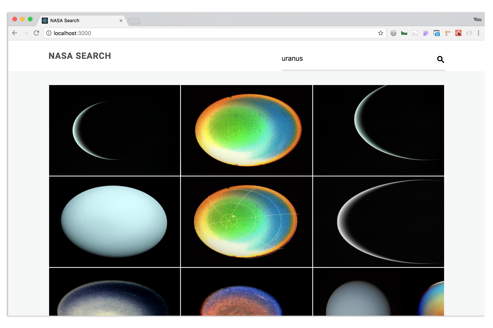

# NASA Search

Front end Tech test based on this [brief](https://jsainsburyplc.github.io/front-end-test/). Utilises the [NASA Image and Video Library](https://api.nasa.gov/api.html#Images) API.

Built using `create-react-app`.

Work in progress.



## Running the App:

```bash
git clone git@github.com:cloverc/nasa-search.git
cd nasa-search
npm i
npm start
```